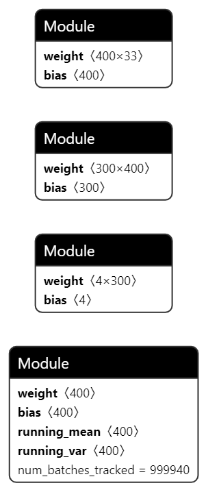
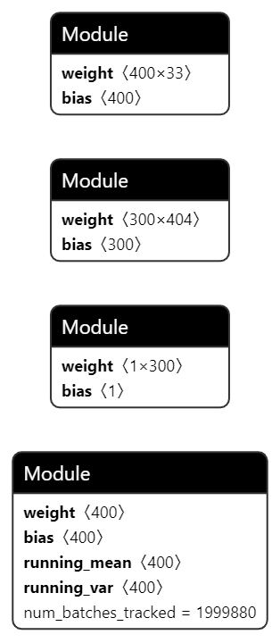
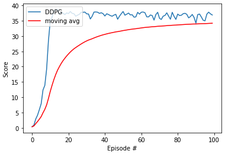

# Project 2: Continuous Control

$\theta

### Architecture

Actor: 3 fully connected layers (`nn.Linear`) with a tanh activation on the output to bound the output between -1 and 1. There is one batch normalization layer after the first fully connected one (`nn.BatchNorm1d`).

Critic: 3 fully connected layers where the second fully connected layer accepts as input (output_fc1 + action). There is one batch normalization layer after the first fully connected one.

All other activation functions are `F.leaky_relu`, in order to avoid dead neurons when learning.

### Training results

### Ideas for future work

Given the parallel agent environment, I would like to try out `A3C` or `D4PG`. I believe that these would work well. Anything that exploits the multiple agents would benefit greatly.

I would also like to try Trust Region Policy Optimization (TRPO), as it seems fitting for the continuous space.

Another improvement I could intriduce would be to prioritize the replay memory as many papers do. Not all states would generate equal contributions to the learning process.
